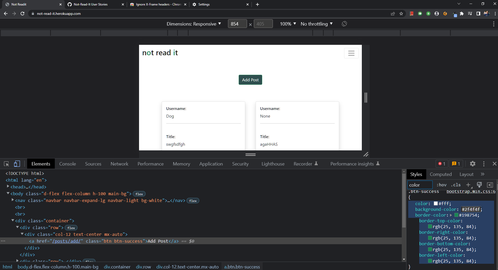

# Not Read It

## by Tadhg Nolan

[Live Site](https://not-read-it.herokuapp.com/)

# Table of Contents
1. [Intro](#intro)
2. [Technologies](#technologies)
3. [Features](#features)
4. [Testing](#testing)
5. [Credits](#credits)
6. [Deployment](deployment)

## Intro

 - Not Read It is a socail media website similar to Reddit.  

### Design

#### UX

An Agile methodology was used in planning the project utilising Github's Project kanban.
Issues were used to create user stories. When work began on a user story, it was moved to the "In Progress" column. When the task is complete, it is moved to the "Done" column.
A collumn named [Future Features](https://github.com/tadhgnolan/not-read-it/projects/1#column-18863244) is used for prospective features for the website and for any features that 
were not complete by the project deadline.

#### UI

**Wireframe Images**

---

---

#### **Entity Relationship Diagram**

---

### User Stories

- View Post List: As a Site User I can view a list of posts so that I can select one to read. [#2](https://github.com/tadhgnolan/not-read-it/issues/2)
- Open a Post: As a Site User I can click on a post so that I can read the full text. [#3](https://github.com/tadhgnolan/not-read-it/issues/3)
- Manage Posts: As a Site User / Admin I can create, read, update and delete posts so that I can manage my content on the website. [#5](https://github.com/tadhgnolan/not-read-it/issues/5)
- Account Registration: As a Site User I can register an account so that I can comment and like. [#8](https://github.com/tadhgnolan/not-read-it/issues/8)
- Site Navigation: As a Site User I can easily navigate the site using the navbar or get back to the home page by clicking the logo. [#14](https://github.com/tadhgnolan/not-read-it/issues/14)
- Select Category: As a Site User / Admin I can select a topic category when creating a post. [#15](https://github.com/tadhgnolan/not-read-it/issues/15)
- Categories: As a Site Admin I can create, view, update and delete categories on the website. [#16](https://github.com/tadhgnolan/not-read-it/issues/16)

## Technologies

### Languages

- [Python](https://www.python.org/about/)

### Other Technologies and Libraries 

- [GitHub](https://github.com/)
- [GitPod](https://www.gitpod.io/about/)
- [Heroku](https://heroku.com)
- [Django](https://www.djangoproject.com/)
- [WhiteNoise](http://whitenoise.evans.io/en/stable/)
- [PostgreSQL](https://www.postgresql.org/about/)

## Features 

### Existing Features:

#### **Registration Page - allows new users to register an account with username and password.**

#### **Login Page - registered user can login.**

#### **Home Page - usersers can view list of posts.**

#### **Add post - registered users can add new posts, enter a title and select a category from a drop down menu.**

#### **Update post - registered users can update their existing posts.**

#### **Delete post - registered users can delete their existing posts.**

#### **Admin functionality - admins can update and delete categories.**

### Features Left to Implement

Like / Unlike: As a Site User I can like or unlike a post so that I can interact with the content.

View Likes: As a Site User / Admin I can view the number of likes on each post so that I can see which is the most popular or viral.

Comment on a Post: As a Site User I can leave comments on a post so that I can be involved in the conversation.

Approve Comments: As a Site Admin I can approve or disapprove comments so that I can filter out objectionable comments.

View Comments: As a Site User / Admin I can view comments on an individual post so that I can read the conversation.

Category List: As a Site User I can view a list of categories so that I can view posts within.

## Testing

### Manual testing

- Manually testing each each path. 

---
**Manual Test of post paths**

---

---
- ### Repeated real world testing performed with:

### **Google Pixel 3aXL (2160 × 1080px)**
---  

---
### **Nokia 3 (720 x 1280)**
---

---
### **Lenovo Ideapad Duet Chromebook (1080 x 1200px)**
---
**Laptop mode**

**Tablet mode**

---
### **Desktop PC (1920 x 1080px + 2560 × 1440) representing a mixture of age plus hardware capability & were readily available.**
---

**1920 x 1080px**

---

**2560 x 1440px**

---

### In Chrome Dev Tools, tested repeatedly with all available presets

This functionality testing involved:

- Verifying all navbar & other links functioned as expected.

---
**iPhone X**

---

---
**Samsung Galaxy S20 Ultra**

---

---
**iPhone 6/7/8**

---

---

- Using Chrome Dev Tools Elements tab to test out small styling changes before adding.

- Checking that fonts scaled correctly for each display size.

- Checking for overflow.

**Checked for overflow using [Unicorn Revealer](https://chrome.google.com/webstore/detail/unicorn-revealer/lmlkphhdlngaicolpmaakfmhplagoaln?hl=en-GB)**

### Validator Testing 

- Tested html at https://validator.w3.org.

Initiallyfound one HTML error, missing lang element in HTML Tag. Resolved Issue. Remaining errors due to Django.

- Tested CSS at https://jigsaw.w3.org/css-validator/

### Lighthouse Score

### Unfixed Bugs

**Known CSS MIME bug. Unable to resolve**

The live deployed application can be found at [not read it](https://not-read-it.herokuapp.com/).

### Heroku Deployment

This project uses [Heroku](https://www.heroku.com), a platform as a service (PaaS) that enables developers to build, run, and operate applications entirely in the cloud.

Deployment steps are as follows, after account setup:

- Select *New* in the top-right corner of your Heroku Dashboard, and select *Create new app* from the dropdown menu.
- Your app name must be unique, and then choose a region closest to you (EU or USA), and finally, select *Create App*.
- From the new app *Settings*, click *Reveal Config Vars*, and set the following key/value pairs:
  - `DATABASE_URL` (this comes from the **Resources** tab, you can get your own Postgres Database using the Free Hobby Tier)
  - `SECRET_KEY` (this can be any random secret key)

Heroku needs two additional files in order to deploy properly.
- requirements.txt
- Procfile

You can install this project's requirements (where applicable) using: `pip3 install -r requirements.txt`. If you have your own packages that have been installed, then the requirements file needs updated using: `pip3 freeze --local > requirements.txt`

The Procfile can be created with the following command: `echo web: gunicorn notreadit.wsgi > Procfile`

For Heroku deployment, follow these steps to connect your GitHub repository to the newly created app:

Either:
- Select "Automatic Deployment" from the Heroku app.

Or:
- In the Terminal/CLI, connect to Heroku using this command: `heroku login -i`
- Set the remote for Heroku: `heroku git:remote -a <app_name>` (replace app_name with your app, without the angle-brackets)
- After performing the standard Git `add`, `commit`, and `push` to GitHub, you can now type: `git push heroku main`

The frontend terminal should now be connected and deployed to Heroku.

### Local Deployment

*Gitpod* IDE was used to write the code for this project.

To make a local copy of this repository, you can clone the project by typing the follow into your IDE terminal:
- `git clone https://github.com/tadhgnolan/not-read-it.git`

You can install this project's requirements (where applicable) using: `pip3 install -r requirements.txt`.

Alternatively, if using Gitpod, you can click below to create your own workspace using this repository.

Additionally, you'll need to create your own `env.py` file with the following keys:

- `SECRET_KEY` (can be any secret value)
- `DATABASE_URL` (this comes from the "Resources" tab on your Heroku app)
   
   

## Credits 

 - A social media site designed by Tadhg Nolan
 
### Content 

- [Django Blog](https://github.com/Code-Institute-Solutions/Django3blog/tree/master/12_final_deployment) Used  and modified code from this Github repository.

### Special Thanks

- Cormac Nolan - Feedback and advice.
- Tim Nelson - Mentor.